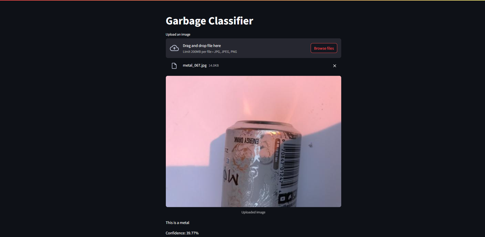

## Garbage Image Classifier AI Web App

A beginner-friendly AI web application that classifies garbage into six categories— `cardboard`, `glass`, `metal`, `paper`, `plastic`, and `trash`. Developed as part of an AICTE internship project, the app is built using **TensorFlow/Keras** for the model and **Streamlit** for the interface. It supports live deployment from **Google Colab** using LocalTunnel.

---

### Motivation

I created this tool to:

* **Automate garbage identification** to reduce manual sorting labor
* Encourage environmentally sound practices by supporting **Reduce, Reuse, Recycle (3Rs)**
* Demonstrate how AI can help build **smart, sustainable cities**
* Provide a practical, deployable project for your AI learning journey

---

###  How the Model Works

The notebook (`GarbageCollection.ipynb`) walks through:

1. **Loading** a garbage dataset using `image_dataset_from_directory()`
2. **Preprocessing** images by resizing to 224×224 and converting to tensors
3. Training a **CNN** (or using transfer learning, e.g., MobileNetV2)
4. Monitoring **training/validation accuracy and loss**
5. Saving the trained model as:

   ```python
   model.save("model.h5")
   ```

---


### 🚀 Run the App on Google Colab

**1. Upload your files** in Colab:

* `GarbageCollection.ipynb` (for reference)
* `model.h5` (trained model)

**2. Install dependencies:**

```bash
!pip install -q streamlit localtunnel
```

**3. Launch the web app:**

```bash
!streamlit run app.py & npx localtunnel --port 8501
```

**4. Open the public link** that appears (e.g., `https://cool-garbage.loca.lt`).
If prompted for a password, run:

```bash
!curl https://loca.lt/mytunnelpassword
```

Get the code and enter it in the browser.

---

### 🗂️ Repository Layout

```
.
├── GarbageCollection.ipynb   # Model training notebook 
├── Trash_dataset
└── README.md                 
```

---

### Sample Web App Experience

* User uploads a photo of a plastic bottle
* App displays:

 

---

###  Why It Matters
* Cuts down on manual labor for waste sorting
* Reinforces sustainable environmental behavior
* Acts as a stepping stone toward **AI-integrated recycling systems**
* Demonstrates real-world application of AI training, model building, and web deployment in one workflow

---

### 🛠 Tools & Libraries

* **TensorFlow / Keras** – Deep learning model
* **Streamlit** – Simple UI frontend
* **NumPy** – Image processing
* **LocalTunnel** – Browser deployment from Colab
* **Python**

---

